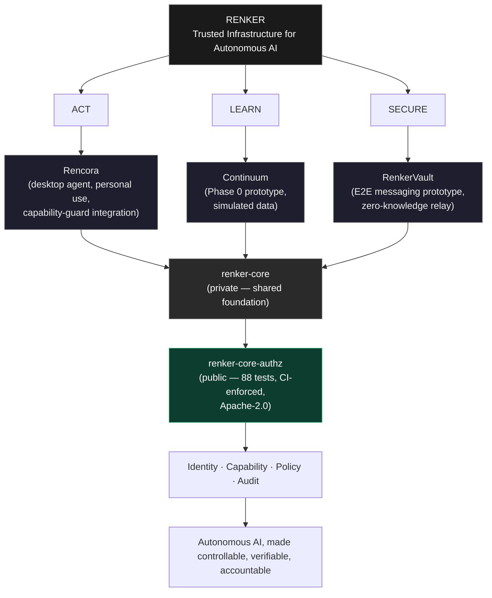

# RENKER Ecosystem Diagram

Reflects actual current state (2026-08-11): which repos are public, what status each pillar is at, and where the shared foundation sits. Use the Mermaid version for docs/website that render Mermaid; use the ASCII version for READMEs and plain-text contexts (GitHub renders Mermaid in READMEs too, but ASCII is a safe fallback and reads well in terminals).

## Mermaid version



## ASCII version (for READMEs / terminal contexts)

```text
                              RENKER
                                |
                TRUSTED INFRASTRUCTURE FOR AUTONOMOUS AI
                                |
         +----------------------+----------------------+
         |                      |                       |
        ACT                   LEARN                   SECURE
         |                      |                       |
      RENCORA               CONTINUUM               RENKERVAULT
   (desktop agent,        (Phase 0 prototype,      (E2E messaging,
   personal use,           simulated data,          zero-knowledge
   guard integration)      real-lab: planned)        relay)
         |                      |                       |
         +----------------------+----------------------+
                                |
                          RENKER-CORE  (private)
                                |
                  Identity / Capability / Policy / Audit
                                |
                        renker-core-authz (public)
                    88 tests · CI-enforced · Apache-2.0
                                |
                    Autonomous AI, made controllable,
                        verifiable, accountable
```

## Notes on accuracy

- `renker-core` is drawn as **private** — it is not publicly browsable today, and the diagram should not imply otherwise. See `reality-check.md` for what that means for claims about it.
- `renker-core-authz` is drawn as a distinct box beneath `renker-core`, not merged with it, because from the outside the exact relationship between the two (fork, subset, successor) isn't publicly documented yet. Recommend the platform publish one canonical sentence clarifying this relationship (see `marketing-status.md`, action items) — until then, the diagram undersells rather than oversells the connection.
- Each pillar box carries a one-line status qualifier (prototype / personal use / Phase 0) so the diagram itself never implies more maturity than `reality-check.md` supports. If a pillar's status changes, update the qualifier here before reusing the diagram anywhere else.
- Do not add logos, screenshots, or additional visual weight beyond what's here without checking `visual-system.md` — the goal is a diagram that reads as engineering documentation, not a product marketing graphic.
